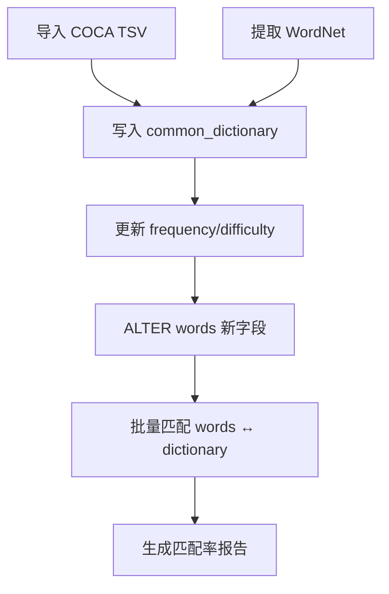

# 词典模块设计与实施路线

> 项目: Word Frequency Analysis  
> 文件路径: docs/developer/dictionary-design.md  
> Author: Sherryyue  
> Created: 2025-07-01

---

## 1. 目标

1. 构建**常用词版离线英语词典** (≈ 60 K 词)，提供权威词频与基础定义。  
2. 与现有 `words` 表实现软关联，支持个人状态统计与文本难度评估。  
3. 保持架构可扩展，未来可升级到**完整词典版** (> 140 K 词)。

---

## 2. 数据源

| 数据源 | 用途 | 许可 | 备注 |
|--------|------|------|------|
| COCA 60 K 词频表 | 现代词频 (Rank/TOTAL/五域) | 免费样本 | 作为核心排名依据 |
| WordNet (NLTK) | 词汇列表 + 定义 + 词性 | BSD-like | 用于补充定义信息 |
| wordfreq 库 | 现代词频补丁 | MIT | 用于填补 COCA 空缺 |
| GSL / AWL / CET 等 | 学习分级标签 | CC-BY | 可选后续补充 |

---

## 3. 表结构设计

### 3.1 `common_dictionary` (常用词典表)

| 字段 | 类型 | 说明 |
|------|------|------|
| `id` | TEXT (PK) | UUID |
| `word` | TEXT UNIQUE | 标准词形 (小写) |
| `lemma` | TEXT | 词根 (同 `word`) |
| `pos_primary` | TEXT | 主要词性 (n/v/adj/adv) |
| `definition` | TEXT | 核心定义 (一句话) |
| `frequency_rank` | INTEGER | 1-60 000 |
| `difficulty_level` | INTEGER | 1-5，后续计算 |
| `source_tags` | TEXT | "COCA,GSL" 等 |
| `created_at` | TIMESTAMP | |

索引: `word`, `lemma`, `frequency_rank`。

### 3.2 `words` 表扩展字段

```
ALTER TABLE words ADD COLUMN dictionary_lemma TEXT;
ALTER TABLE words ADD COLUMN dictionary_found BOOLEAN DEFAULT FALSE;
ALTER TABLE words ADD COLUMN dictionary_info JSON;
-- 个人学习字段 (可同批添加)
ALTER TABLE words ADD COLUMN personal_status TEXT CHECK (personal_status IN ('new','learn','know','master'));
ALTER TABLE words ADD COLUMN personal_notes TEXT;
ALTER TABLE words ADD COLUMN difficulty_rating INTEGER;
```

索引: `dictionary_lemma`, `personal_status`。

---

## 4. 数据流程



### 匹配规则 (优先级)
1. `word` 完全匹配  
2. `lemma` 匹配  
3. 变形匹配 (`common_forms` LIKE %word%)  
4. 未命中 → `dictionary_found = 0` (后续人工/脚本补录)

---

## 5. 实施路线

| 阶段 | 预计耗时 | 关键任务 |
|-------|---------|----------|
| **P0 方案冻结** | — | 字段 & 数据源确认 (已完成) |
| **P1 字典构建** | 1 天 | 1) 建表 2) 解析 COCA 3) 导入 WordNet 定义 |
| **P2 数据库迁移** | 0.5 天 | `ALTER TABLE words` + 创建索引 |
| **P3 批量匹配** | 1 天 | 脚本跑匹配，生成统计报告 (目标匹配率 ≥ 85%) |
| **P4 管道集成** | 1 天 | 将匹配逻辑嵌入文本/词表导入流程 |
| **P5 后续增强** | 可迭代 | 1) 计算 `difficulty_level` 2) 标签补丁 3) 提供 CLI/API 查询 |

---

## 6. 未决事项

1. **POS 映射**：COCA `POS` 与 WordNet tag 对齐方案。  
2. **难度公式**：`difficulty_level` 依据(词频+定义复杂度)的权重比例。  
3. **专有名词处理**：是否过滤首字母大写词。 不过滤
4. **COCA POS 对接**：仅保留 rank / pos / word 三列，六语域字段不导入。

---

## 7. 结论

• **可行性高**：纯本地数据源、实现简单、安全开源。  
• **迭代友好**：先落地常用词典，随后可追加完整词典或更多字段。  
• **影响面小**：仅对 `words` 表做可逆扩展，无需大规模重构。  

---

## 8. 实施完成状态 ✅

### 已完成功能 (2025-07-01)

✅ **P0-P4 全部完成**  
- [x] `common_dictionary` 表设计与实现  
- [x] `words` 表扩展字段  
- [x] COCA 60K 词频表导入工具 (`DictionaryImporter`)  
- [x] WordNet 定义补充  
- [x] 文本处理自动字典匹配集成  
- [x] 个人词汇状态管理 (`PersonalStatusManager`)  
- [x] CLI 命令扩展 (`dictionary`, `personal` 命令组)  
- [x] 数据库视图和索引优化  
- [x] 完整系统测试脚本  

### 核心文件  
- `core/models/schema.py` - 数据库架构  
- `core/engines/input/dictionary_importer.py` - 字典导入  
- `core/engines/vocabulary/personal_status_manager.py` - 个人状态管理  
- `core/engines/database/unified_database.py` - 文本处理集成  
- `interfaces/cli/main.py` - CLI 命令  
- `scripts/test_dictionary_system.py` - 测试脚本  

### 使用方法
```bash
# 导入COCA词表
python -m interfaces.cli.main dictionary import coca_60k.txt --update-mapping

# 处理文本(自动字典匹配)  
python -m interfaces.cli.main text process data/files/new/

# 管理个人词汇状态
python -m interfaces.cli.main personal set "computer" know
python -m interfaces.cli.main personal stats

# 分析文档难度
python -m interfaces.cli.main personal analyze <document_id>
```

### P5+ 未来增强计划
- [ ] `common_forms` 变形字段实现  
- [ ] 性能优化和查询缓存  
- [ ] 完整词典版本 (140K+ 词汇)  
- [ ] Web 界面集成  
- [ ] 更复杂的难度算法

---

## 9. 架构重构说明 (2025-07-01)

### 重构背景
用户反馈：`dictionary_importer` 不应放在 `input` 模块，因为这不是用户输入，而是系统内置功能。

### 重构内容
1. **字典管理器迁移**  
   - `core/engines/input/dictionary_importer.py` → `core/engines/database/dictionary_manager.py`
   - 功能定位：系统内置词典管理，不是用户输入功能

2. **用户输入类型明确化**  
   `core/engines/input/` 现在只包含三种真正的用户输入：
   - `file_processor.py` - 用户文本文件处理
   - `modern_wordlist_import.py` - 用户词汇表导入  
   - `personal_wordlist_import.py` - 用户个人学习状态导入/导出

3. **CLI命令调整**
   - `dictionary import` - 系统维护功能，注明"系统维护"
   - `personal import/export` - 新增个人词汇表导入导出功能

### 架构原则
- **系统数据 vs 用户数据清晰分离**
- **input模块只处理用户真实输入**  
- **database模块管理所有系统内置数据**
- **vocabulary模块负责用户学习状态管理**

### 更新文件列表
- `core/engines/database/dictionary_manager.py` (新建)
- `core/engines/input/personal_wordlist_import.py` (新建)  
- `core/engines/database/unified_database.py` (更新引用)
- `interfaces/cli/main.py` (更新命令)
- `scripts/test_dictionary_system.py` (更新测试)

### 使用方法（重构后）
```bash
# 系统维护（管理员）
python -m interfaces.cli.main dictionary import coca_60k.txt --update-mapping
python -m interfaces.cli.main dictionary stats

# 用户输入
python -m interfaces.cli.main text process data/files/new/
python -m interfaces.cli.main wordlist import my_wordlist.txt  
python -m interfaces.cli.main personal import my_vocab_status.csv
python -m interfaces.cli.main personal export my_backup.csv

# 个人状态管理
python -m interfaces.cli.main personal set "computer" know
python -m interfaces.cli.main personal stats
python -m interfaces.cli.main personal analyze <document_id>
``` 